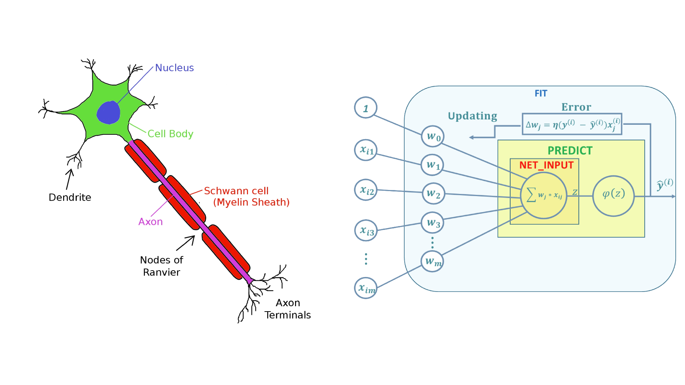

# Perceptron-model-development
Develop the perceptron model using object oriented approch.

The Perceptron model is based on a biological neuron, so it's possible capture some analogies between this two elements.
In a biological neuron, there are four principal elements:

1.   Dendrite
2.   Nucleus
3.   Axon
4.   Terminal

Dendrites are like the Perceptron's weight, the net input *z* is analogus to the nucleus, the axon is comparable to the activation function, and the output is corrispond to the axon terminal.

I'll try to develop the Perceptron model using object-oriented approch.
I'll define a new Perceptron class with four methos: 

1.   **Fit: **: Used to understand and learn the data
2.   **Predict: ** Used to classify new data
3.   **net_input: ** Used to calculate the sum of input and weight 
4.   **predict: ** Used to predict the class using Unit step function

5.   At the end i'll try the Perceptron model with iris dataset downloaded from UCI Repo
