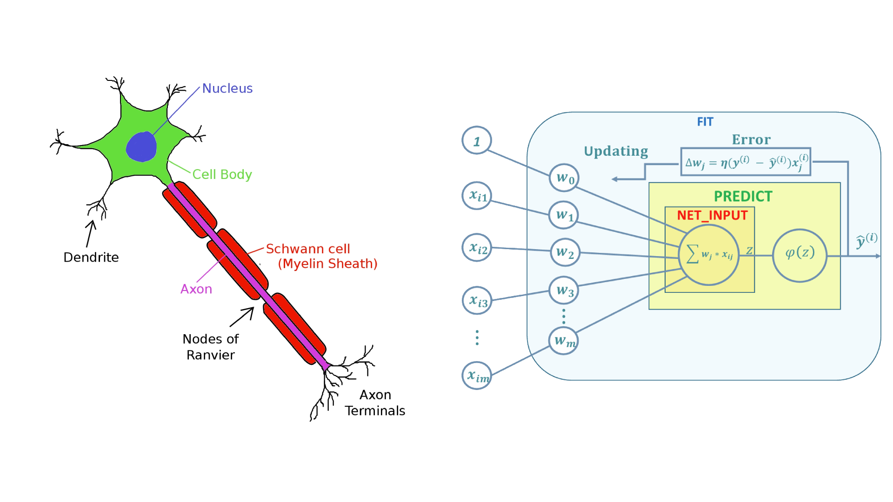

# Perceptron-model-development
Develop the perceptron model using object oriented approch.

The Perceptron model is based on a biological neuron, so it's possible capture some analogies between this two elements.
In a biological neuron, there are four principal elements:

1.   Dendrite
2.   Nucleus
3.   Axon
4.   Terminal

Dendrites are like the Perceptron's weight, the net input *z* is analogus to the nucleus, the axon is comparable to the activation function, and the output is corrispond to the axon terminal.

